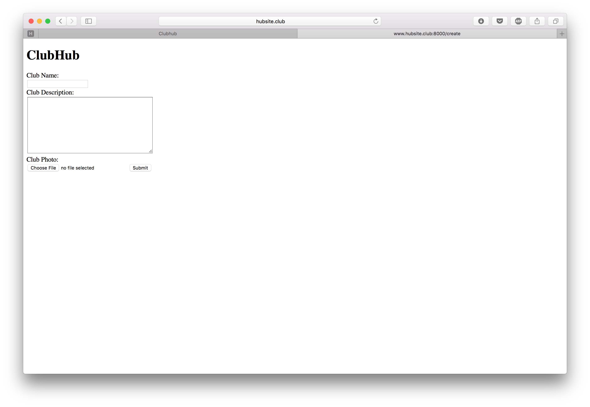
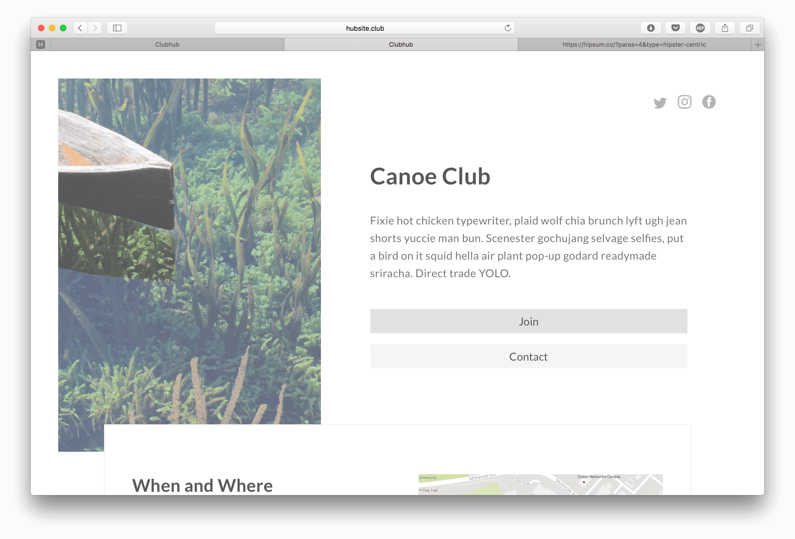

# ClubHub

ClubHub streamlines the setup and maintenance of engaging club websites.

### Landing Page
[Landing Page](http://www.hubsite.club:8000/)

### Link to Application
[Create Hubsite](http://www.hubsite.club:8000/create)  
  
[Sample](http://www.hubsite.club:8000/sample)

### Feature List
https://github.com/Wubbadub/ClubHub/wiki/Feature-List

### Problem Definition
https://github.com/Wubbadub/ClubHub/wiki/Problem-Definition
