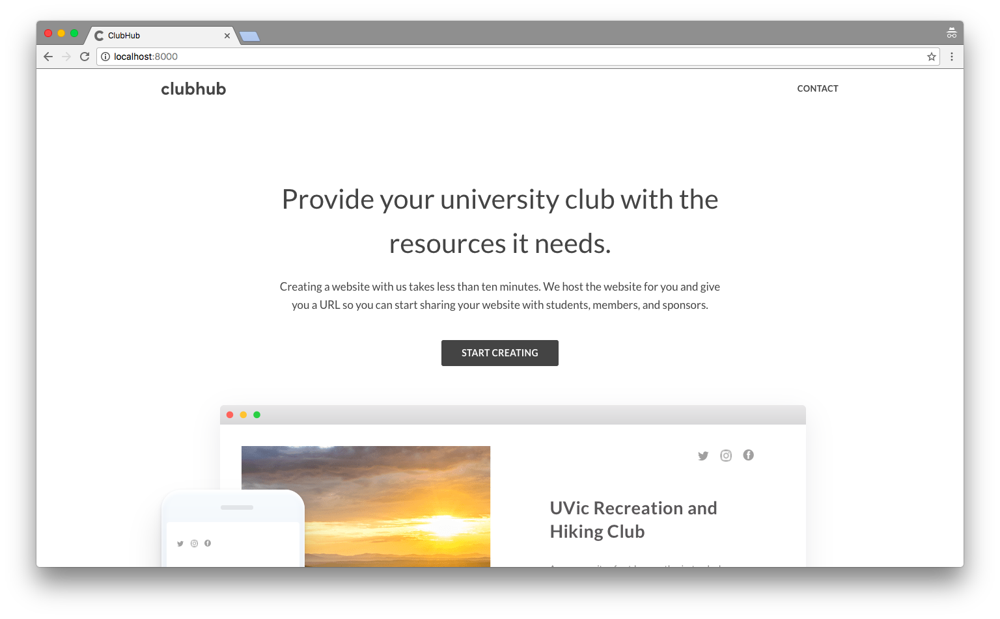

     
    
      
    
    
      
    
ClubHub provides your university club with the resources it needs.

    

### Repository Directory

* [Issues Tracking](https://github.com/Wubbadub/ClubHub/issues)
* [Milestone Progress](https://github.com/Wubbadub/ClubHub/milestones)
* [Feature List](https://github.com/Wubbadub/ClubHub/wiki/Feature-List)
* [Problem Definition](https://github.com/Wubbadub/ClubHub/wiki/Problem-Definition)
* [Our Team](https://github.com/orgs/Wubbadub/people)
